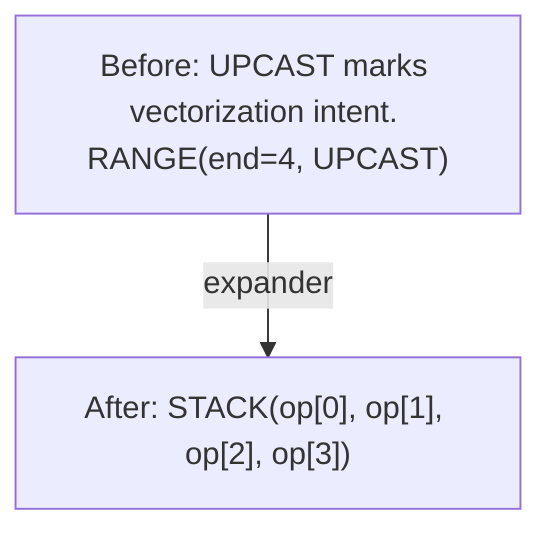
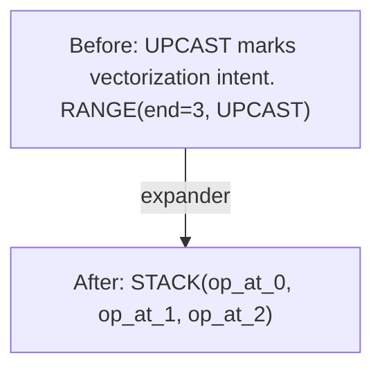
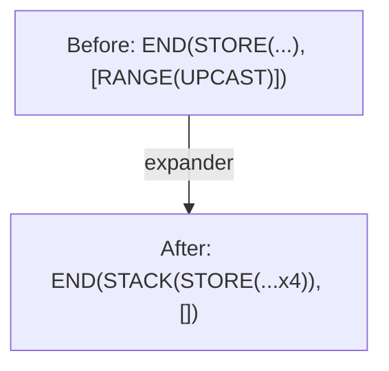
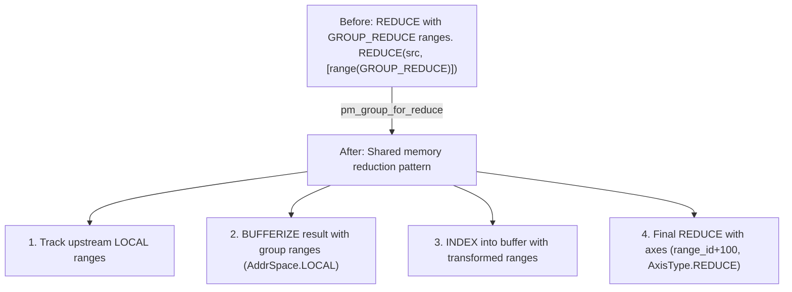

# Phase 2: Expander

**Goal**: Transform optimization primitives (UNROLL/UPCAST) into explicit operations.

---

## Stage 8: Post-Opt Symbolic

> **Stage at a Glance**
>
> **Goal**: Symbolic simplification after optimization
> **Key Patterns**: WHERE movement, constant folding
> **Impact**: Enables better load combining and vectorization

**What This Does**: Symbolic simplification after optimization, plus WHERE movement.

**Why This Matters**: WHERE operations are like `if` statements. This stage moves `if` checks from after a load to before the load. Hardware can skip loading when the condition is false, saving memory bandwidth.

**Pattern**: `sym + pm_move_where_on_load`

```text
// Before: WHERE guards a load
WHERE(valid, LOAD(index), alt)

// After: validity moved to INDEX
LOAD(INDEX(ptr, idx, valid=valid), alt)
```

Moving validity into INDEX enables better load combining and vectorization.

**Note**: This pattern only matches when the alternative value is `0`. The transformation involves complex clause analysis: duplicate detection, range dependency checks, and data-dependent load verification.

**Note**: The Svod implementation uses `gate=` instead of `valid=` (the Index struct has a `gate` field). The concept is identical.

**Svod**: `pm_move_where_on_load()` in `symbolic/patterns.rs`

---

## Stage 9: Expander

> **Stage at a Glance**
>
> **Goal**: Expand UPCAST and UNROLL ranges into explicit STACK/INDEX structure
> **Key Concepts**: range axis types, STACK, INDEX, pattern order
> **Impact**: Makes vectorization explicit and ready for hardware

**What This Does**: Transforms UPCAST/UNROLL range classifications into explicit operations.

**Why This Matters**: UPCAST and UNROLL mark intent—what we want to do. This stage makes that intent explicit so the hardware can actually do it.

**Pattern**: `symbolic_simple() + pm_pre_expander + pm_group_for_reduce + expander`

Note: Svod uses `symbolic_simple()` (not `sym`) at this stage since `symbolic()` already ran at Stage 4. Tinygrad uses `sym` which includes additional patterns.

⚠️ **Important: Pattern Precedence**

The patterns are combined and run to fixpoint. The order affects which pattern is tried first when multiple could match:
1. `sym` first (symbolic simplification)
2. `pm_pre_expander` second (converts UPCAST/UNROLL ranges)
3. `pm_group_for_reduce` third (handles GROUP_REDUCE axis)
4. `expander` last (main expansion)

Wrong precedence can cause incorrect vectorization or reduction scoping.

Expanded lanes are collected with `STACK` and selected with `INDEX`. UNROLL is
an `AxisType` on `RANGE`, not a standalone operation.

**UPCAST range → VECTORIZE**:


**UNROLL range → repeated operations**:

When we say "operations duplicated," it sounds like copy-paste. But that's not what happens. The compiler creates a single SIMD instruction that processes all N elements together. Think of a SIMD register as a box holding 4 numbers; adding two boxes adds all 8 numbers at once.



**Expanded END interaction**:


**Broadcast through AFTER/END**:
```text
// Broadcast VECTORIZE (all elements identical)
AFTER(VECTORIZE([x, x, x, x]), deps) → VECTORIZE([AFTER(x, deps), AFTER(x, deps), ...])
```

**GROUP_REDUCE Handling** (`pm_group_for_reduce`):

GROUP_REDUCE is a special axis type for tensor core reductions:



This enables efficient tensor core accumulation via shared memory.

**Svod**: `expand.rs`

---

## Stage 10: Add Local Buffers

> **Stage at a Glance**
>
> **Goal**: Prepare buffers for fast memory (shared / L1)
> **Key Patterns**: Bufferize with locals, extract hints
> **Impact**: Frequently-accessed data stays in fast memory

**What This Does**: Prepares buffers for local memory usage and applies codegen-specific cleanups.

**Why This Matters**: **Local buffers** = fast memory close to the compute unit:
- GPU: Shared memory (LDS) — 100x faster than global memory
- CPU: L1 cache — 10x faster than main memory

The compiler moves frequently-accessed data to local buffers, similar to keeping important files on your desktop instead of a network drive.

**Pattern**: `pm_add_buffers_local + rangeify_codegen`

| Transform | Purpose |
|-----------|---------|
| `bufferize_to_store` | Convert BUFFERIZE with `allow_locals=true` |
| Strip CONTIGUOUS wrapper | Remove optimization hints before codegen |
| NOOP removal | Clean up no-op operations |

**Svod**: `rangeify/patterns.rs`, `rangeify/transforms.rs`, `optimizer/mod.rs`
