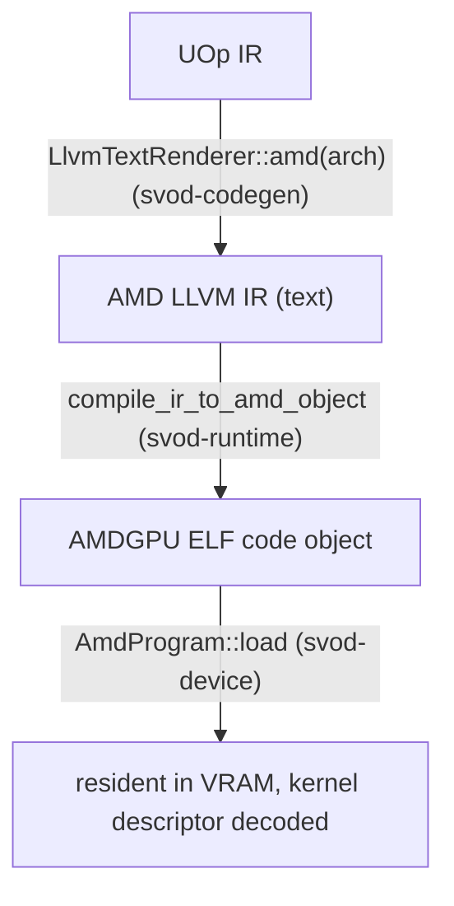

# Compile & Graph

This page follows a kernel from rendered LLVM IR to a running dispatch, then
covers how a whole chain of kernels is captured into a single replayable PM4
graph. The dispatch machinery it builds on — rings, connectors, the timeline —
is described in [Queues & Dispatch](./queues-and-dispatch.md).

---

## From IR to a loaded program

The compile path is **AMD LLVM IR text → `clang` → ELF code object → in-VRAM
load**. Three crates cooperate, wired together in
`runtime/src/devices/amd.rs`:



### Rendering

`AmdRendererWrapper::render` uses `LlvmTextRenderer::amd(arch)` to emit AMD LLVM
IR. It also installs an AMD-specific decomposition pass
(`amd_decomposition_patterns`) that routes `exp`/`log`/trig through SLEEF
polynomials, because the hardware `exp2`/`log2` are lower precision than CPU
libm (`sqrt` stays native).

### Compiling

`compile_ir_to_amd_object` (`runtime/src/amd/compile.rs`) shells out to `clang`,
piping IR in on stdin and reading the ELF back on stdout — no temp files, the
same in-memory style as the [CPU JIT loader](../jit-loader.md):

```text
clang -x ir -c -O3 --target=amdgcn-amd-amdhsa -mcpu=<arch> \
      -mcumode -nogpulib -nogpuinc -Wno-override-module -fno-math-errno - -o -
```

`clang` invokes `lld` internally for a single translation unit, so the output is
a directly-loadable AMDGPU ELF — no separate link step. A cached
`has_amdgpu_target()` probe (`clang --print-targets` for `amdgcn`) turns a clang
without the AMDGPU target into a clean `JitCompilation` error rather than a
crash. Setting `SVOD_DUMP_AMD_IR=<dir>` dumps each kernel's `.ll` for
inspection.

### Loading & descriptor parsing

`AmdProgram::load` (`device/src/amd/program.rs`) parses the ELF with the
`object` crate and lays the image out the way tinygrad's `elf_loader` does:
`SHF_ALLOC` sections with a non-zero address go at their address; address-0
sections are appended aligned. It validates ELF64-LE + `EM_AMDGPU`, applies the
`R_AMDGPU_ABS64` / `R_AMDGPU_REL64` / `R_AMDGPU_REL32` relocations clang emits
(anything else is a clean error, never a silent zero-write), and resolves the
kernel-descriptor symbol **`<name>.kd`**.

From the 64-byte `AmdHsaKernelDescriptor` it derives everything dispatch needs:

| Derived | From |
|---|---|
| `aql_prog_addr` | `code_gpu + kd_offset` (the AQL `kernel_object`) |
| `pm4_prog_addr` | `aql_prog_addr + kernel_code_entry_byte_offset` (the shader entry; the LO/HI registers carry `>> 8`) |
| `rsrc1 / rsrc2 / rsrc3` | `compute_pgm_rsrc{1,2,3}`, patched with the gfx11 cwsr-priv bit and the LDS-size field |
| `wave32` | `kernel_code_properties & 0x400` (RDNA3/4 default) |
| `target_major` | 9 / 11 / 12, from the device arch |
| kernarg / scratch / group sizes | `kernarg_size`, `private_segment_fixed_size`, `group_segment_fixed_size` |

Two safety checks happen at load: an over-large group (LDS) segment fails fast
with `GroupSegmentTooLarge`, and a kernel that sets `ENABLE_SGPR_DISPATCH_PTR`
(which would need an HSA dispatch packet alongside kernargs — not yet wired) is
rejected. The code object is copied into a host-visible, `nolru` VRAM buffer
held for the program's lifetime.

---

## Dispatching a kernel

`AmdProgram::execute_on(conn, buffers, vals, global, local, wait)` is the
connector-scoped dispatch path that plans and graphs use (the `Program::execute`
trait method leases a connector and delegates here). It:

1. **Validates** the buffer and scalar counts against the kernel, and checks the
   kernarg layout fits: `buf_count*8 + var_count*4 ≤ kernarg_size`.
2. **Fills a kernarg slot** by bumping the connector's arena, writing each
   buffer VA as 8 bytes and each scalar as a 4-byte `i32`. The `i32` packing is
   deliberate — the renderer lowers `Index → i32`, so the descriptor's
   `kernarg_size` reflects 4-byte vars; packing 8 bytes would overflow into the
   next slot.
3. **Builds `USER_DATA`** with the kernarg pointer. The optional 4-dword scratch
   descriptor is prepended *inside* `dispatch_pm4`, read from the live
   `scratch_gpu_va()` at the same moment as the `COMPUTE_DISPATCH_SCRATCH_BASE`
   register — so a concurrent scratch realloc can't make the descriptor and the
   register disagree.
4. **Dispatches** — `queue.dispatch_pm4(...)` (PM4 path) or
   `queue.dispatch_aql(...)` with a `build_dispatch_packet` (AQL path).
5. If `wait`, calls `conn.synchronize()`.

---

## Graph capture & replay: `AmdGraph`

When the same kernel chain runs repeatedly (streaming inference), paying the
per-kernel `wait → barrier → exec → signal → doorbell` round-trip N times is
waste. `AmdGraph` (`device/src/amd/graph.rs`) — a 1:1 port of tinygrad's
`HCQGraph` — captures the whole chain into **one PM4 command stream**, binds it
into a host-visible page, and replays it with **one doorbell**.

### Structure

The graph is one device-timeline step:

```text
preamble:  memory_barrier
           wait(virt_timeline, timeline-1)
           wait(kick, kickoff)
           signal(self, kickoff)
per kernel: exec()            ← no inter-kernel signal/wait; same-queue ordering
                                 is the acquire_mem + CS_PARTIAL_FLUSH in exec
final:     signal(virt_timeline, timeline)   ← advances the real timeline by +1
```

The `virt_timeline` address and value are **symbols** (`Sym::VirtTimelineSigAddr`,
`Sym::VirtTimelineVal`, `Sym::Kickoff`) resolved at replay to the connector's
real signal address and `timeline_value() - 1`, so the graph composes with
ordinary per-call dispatch and `synchronize`. Capture lays out one fixed kernarg
slot per kernel in a dedicated page — owning that page (rather than sharing the
rolling kernarg arena, which concurrent per-call dispatch could lap into stale
VAs) is what makes replay safe.

Replay (`Graph::replay`) serializes graph-owned mutable storage, waits its prior
finalizer, acquires an exclusive compute lane, ensures lane scratch, patches the
current kernargs and system fields, then publishes the resident PM4 IB or AQL
submission program. It returns asynchronously; the next replay waits before
reusing that storage.

### When capture happens

Capture is gated several ways, and falls back to per-call dispatch
(`Ok(None)`) if any fails:

- The chain must be **all compiled kernels with no runtime vars** — copies,
  views, and dynamic launch dims keep the host in the loop.
- The chain must be **single-device** and every current replay buffer must be
  backed by that exact physical allocation owner.
- AQL graph capture is supported. PM4 graph capture is opt-in through
  `SVOD_PM4_GRAPH=1` because it is not a performance win on every gfx11/12 GPU.

:::note Queue ownership
Graphs do not retain a hardware queue. Capture stores immutable templates and
graph-owned resident/control memory; every replay leases a bounded pool lane.
:::

---

## Why this matters

Compilation is one `clang` subprocess and an in-process ELF load — no ROCm, no
temp files, the same minimalism as the CPU path. Dispatch reuses the entire
lane/timeline machinery from [Queues & Dispatch](./queues-and-dispatch.md),
so the [JIT Graphs](../../architecture/jit-graphs.md) layer's compile-once / replay-many promise
lands on AMD with one doorbell per replay — once the graph path is enabled.
