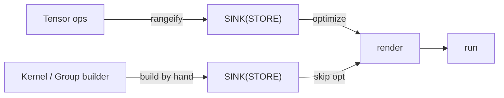
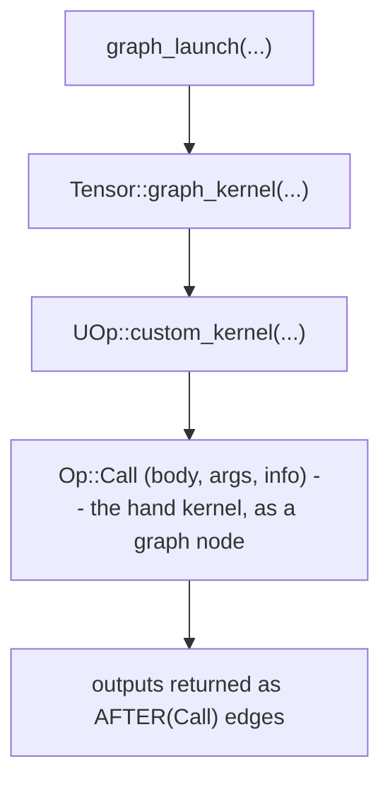
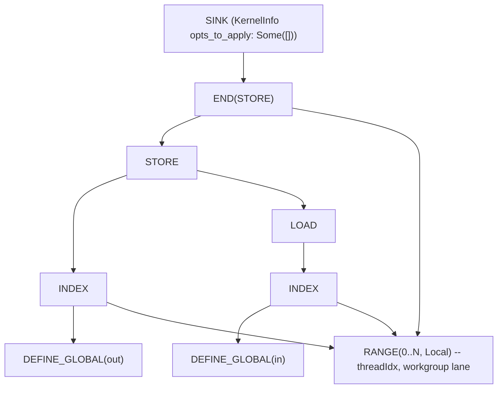

# Authoring into the One IR

This is the chapter where `tk` stops being "a GPU tile library" and becomes "a way to write
UOps by hand." If you haven't read [One IR to Rule Them All](../architecture/ir-design) and
the [Execution Pipeline](../architecture/pipeline), read them first — this chapter assumes
you know what a UOp is and how a lazy `Tensor` becomes a compiled kernel. We won't re-explain
the philosophy. We'll show how a hand-written kernel slots *into* it.

---

## The trick: a kernel is just a subgraph

Recall the central claim from the [overview](./overview): `tk` is a builder, not a backend.
It does not emit assembly. It emits the exact same lowered IR that the normal codegen path
consumes — `RANGE` loops, `INDEX`/`LOAD`/`STORE` memory ops, `WMMA` matrix instructions.

So when you author a kernel, what you're really doing is *constructing a UOp DAG by hand*
instead of letting `rangeify` construct it for you. The output is a `SINK` UOp — the same
thing the scheduler produces for an autotuned kernel.



---

## The builder: `Kernel` and `Group`

You author with two types (from the AUTHOR face in `tk/src/lib.rs`):

- **`Kernel`** (`tk/src/kernel.rs`) is the eager builder. It hands you the raw materials —
  grid/block dimensions (which become `SPECIAL` ops), loop ranges (`RANGE`), shared-memory
  buffers (`DEFINE_LOCAL`), register buffers (`DEFINE_REG`), and global parameters. You bind
  tensors to it and ask it for tiles.
- **`Group`** (`tk/src/group.rs`) is the cooperating wave (or group of waves). It carries the
  *compute* vocabulary: loads and stores between memory spaces, the `mma` matrix multiply,
  reductions, shuffles, elementwise maps.

Every `Group` operation builds UOp nodes directly. A load opens the necessary `RANGE`s, emits a
`STORE` that closes them, and returns the destination tile re-wrapped with a dependency edge so
the next operation orders after it. You're writing a graph, eagerly, one tile op at a time.

When you're done, you call `Kernel::finish(...)`, which closes the open ranges and wraps
everything in a terminal `SINK`.

---

## The one marker that changes everything

Here's the field that makes hand-authoring work. The `SINK` that `finish` produces carries a
`KernelInfo`, and `tk` stamps it with:

```rust
KernelInfo { opts_to_apply: Some(vec![]), name: Some(...), .. }
```

That `opts_to_apply: Some(vec![])` is the whole game. When the optimizer encounters a kernel,
it checks this field (in `schedule/src/optimizer/`):

| `opts_to_apply` | Meaning |
|-----------------|---------|
| `None` | "You choose." Run heuristics, or [beam search](../architecture/optimizations/kernel-search) if enabled. |
| `Some(vec![])` | "This body is **already lowered**. Apply *zero* further optimizations." |
| `Some(non-empty)` | "Apply exactly these optimizations, in order." |

A `tk` kernel uses `Some(vec![])`: you wrote the schedule by hand, so the optimizer leaves it
untouched. The rewrite passes that *do* still run (algebraic simplification, index lowering)
are told not to descend into the kernel body. Your hand-tuned loop survives to codegen exactly
as written — but it's still a normal UOp graph that the *same* renderer turns into LLVM IR and
the *same* runtime executes.

---

## Two ways in: direct launch and graph node

There are two routes from a finished `Kernel` to running code, for the two different audiences.

### Direct launch (the DEBUG face)

`compile` / `launch` / `run_kernel` (`tk/src/launch.rs`) take a finished `SINK`, bind it to
concrete device buffers, render, compile, and dispatch — bypassing the tensor scheduler
entirely. This is how you test and benchmark a kernel in isolation; see the
[debugging chapter](./debugging).

### Graph node (the USE face)

In production you don't want a separate launch — you want the kernel to be part of the lazy
graph, so it fuses into scheduling and dependency tracking like everything else. That path is:



The finished `SINK` becomes the `body` of an `Op::Call` node (see `Op::Call` in the
[Op Bestiary](../architecture/op-bestiary)). Each output tensor is returned as an
`AFTER(Call)` — an ordinary dependency edge. From the scheduler's point of view, your kernel is
just one more node in the DAG with inputs and outputs. It gets scheduled, its buffers get
allocated, its dependencies get tracked — by the same machinery described in the
[Execution Pipeline](../architecture/pipeline).

That's the payoff of "one IR": the hand-written kernel and the autotuned kernel are *peers*.

---

## No silent fallbacks

A subtle failure mode in kernel libraries: you call the fast path, it quietly decides it can't
handle your input, and you get the slow path with no warning — or worse, a wrong answer. `tk`'s
public kernels (`tk/src/kernels/{fa,matmul}.rs`, via `launch_custom` in `tk/src/launch.rs`) are
built to make that impossible. Every entry point returns a three-way result:

| Result | Meaning | What you do |
|--------|---------|-------------|
| `Ok(Some(tensor))` | The kernel ran. | Use the tensor. |
| `Ok(None)` | "Doesn't apply here" — unsupported arch, or the shape doesn't tile cleanly. | Fall back to a graph implementation, deliberately. |
| `Err(...)` | The *request* is malformed — wrong dtype, dimensions not divisible, non-square operands. | Fix the call. This is a bug, raised loudly. |

The distinction between `Ok(None)` (a legitimate "not me") and `Err` (a caller mistake) is the
point. Unsupported hardware routes to a fallback; a dtype the kernel can't accept is an error
you see immediately, not a silent detour to the slow path.

---

## What it looks like as IR

The reward for all this is that a hand kernel prints like any other UOp graph. A trivial tile
store — load a tile, write it back — lowers to the familiar `RANGE` / `INDEX` / `STORE` shape:



No new node types, no separate dialect — the same operations the
[matmul journey in the IR chapter](../architecture/ir-design)
ends on. A real kernel adds `WMMA`, `DEFINE_LOCAL` (LDS), and `DEFINE_REG` (registers), but the
shape is the same: a SINK over a STORE, scoped by ranges.

---

## The deeper insight

The reason Svod can offer *both* "let the compiler find the schedule" and "I'll write the
schedule myself" — without two compilers — is that both produce the same artifact: a `SINK` of
UOps. The optimizer's `opts_to_apply` field is the seam between them, and it's one enum away
from `None`. Autotuned matmul and hand-written Flash Attention compile through one renderer, run
on one runtime, and print with one debugger. The [comparison chapter](./comparison) returns
to why that's unusual.

Next, the wrinkle that makes hand-authoring genuinely hard on AMD:
[keeping a kernel correct across wave32 and wave64](./wave-portability).
