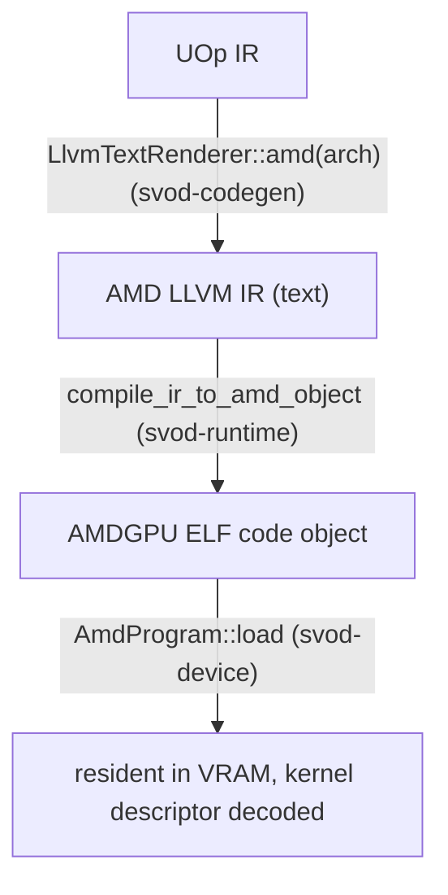

# Compile और Graph

यह पेज एक kernel का अनुसरण करता है, rendered LLVM IR से एक चलते हुए dispatch तक, फिर कवर
करता है कि kernels की एक पूरी chain को एक single replayable PM4 graph में कैसे capture किया
जाता है। जिस dispatch machinery पर यह बना है — rings, connectors, timeline — उसका वर्णन
[Queues और Dispatch](./queues-and-dispatch.md) में है।

---

## IR से एक loaded program तक

compile path है **AMD LLVM IR text → `clang` → ELF code object → in-VRAM load**। तीन crates
मिलकर काम करते हैं, जिन्हें `runtime/src/devices/amd.rs` में एक साथ wire किया गया है:



### Rendering

`AmdRendererWrapper::render` AMD LLVM IR emit करने के लिए `LlvmTextRenderer::amd(arch)` का
उपयोग करता है। यह एक AMD-specific decomposition pass (`amd_decomposition_patterns`) भी
install करता है जो `exp`/`log`/trig को SLEEF polynomials के माध्यम से route करता है, क्योंकि
hardware `exp2`/`log2` CPU libm से कम precision के हैं (`sqrt` native ही रहता है)।

### Compiling

`compile_ir_to_amd_object` (`runtime/src/amd/compile.rs`) `clang` को shell out करता है, IR
को stdin पर pipe करते हुए और ELF को वापस stdout पर पढ़ते हुए — कोई temp files नहीं, वही
in-memory style जो [CPU JIT लोडर](../jit-loader.md) का है:

```text
clang -x ir -c -O3 --target=amdgcn-amd-amdhsa -mcpu=<arch> \
      -mcumode -nogpulib -nogpuinc -Wno-override-module -fno-math-errno - -o -
```

`clang` एक single translation unit के लिए internally `lld` invoke करता है, इसलिए output एक
directly-loadable AMDGPU ELF है — कोई अलग link step नहीं। एक cached `has_amdgpu_target()`
probe (`amdgcn` के लिए `clang --print-targets`) AMDGPU target के बिना एक clang को एक crash
के बजाय एक साफ़ `JitCompilation` error में बदल देता है। `SVOD_DUMP_AMD_IR=<dir>` सेट करना हर
kernel का `.ll` inspection के लिए dump करता है।

### Loading और descriptor parsing

`AmdProgram::load` (`device/src/amd/program.rs`) ELF को `object` crate से parse करता है और
image को उसी तरह lay out करता है जैसे tinygrad का `elf_loader` करता है: non-zero address
वाले `SHF_ALLOC` sections अपने address पर जाते हैं; address-0 sections aligned append किए
जाते हैं। यह ELF64-LE + `EM_AMDGPU` validate करता है, clang द्वारा emit की गई
`R_AMDGPU_ABS64` / `R_AMDGPU_REL64` / `R_AMDGPU_REL32` relocations apply करता है (और कुछ भी
एक साफ़ error है, कभी एक silent zero-write नहीं), और kernel-descriptor symbol **`<name>.kd`**
को resolve करता है।

64-byte `AmdHsaKernelDescriptor` से यह वह सब कुछ derive करता है जो dispatch को चाहिए:

| Derived | किससे |
|---|---|
| `aql_prog_addr` | `code_gpu + kd_offset` (AQL `kernel_object`) |
| `pm4_prog_addr` | `aql_prog_addr + kernel_code_entry_byte_offset` (shader entry; LO/HI registers `>> 8` carry करते हैं) |
| `rsrc1 / rsrc2 / rsrc3` | `compute_pgm_rsrc{1,2,3}`, gfx11 cwsr-priv bit और LDS-size field के साथ patched |
| `wave32` | `kernel_code_properties & 0x400` (RDNA3/4 default) |
| `target_major` | 9 / 11 / 12, device arch से |
| kernarg / scratch / group sizes | `kernarg_size`, `private_segment_fixed_size`, `group_segment_fixed_size` |

load पर दो safety checks होती हैं: एक over-large group (LDS) segment `GroupSegmentTooLarge`
के साथ fail-fast होता है, और एक kernel जो `ENABLE_SGPR_DISPATCH_PTR` सेट करता है (जिसे
kernargs के साथ एक HSA dispatch packet चाहिए होगा — अभी तक wired नहीं) reject कर दिया जाता
है। code object को एक host-visible, `nolru` VRAM buffer में copy किया जाता है जो program के
जीवनकाल के लिए रखा जाता है।

---

## एक kernel dispatch करना

`AmdProgram::execute_on(conn, buffers, vals, global, local, wait)` वह connector-scoped
dispatch path है जिसका plans और graphs उपयोग करते हैं (`Program::execute` trait method एक
connector lease करता है और यहाँ delegate करता है)। यह:

1. kernel के विरुद्ध buffer और scalar counts को **validate** करता है, और जाँचता है कि
   kernarg layout फ़िट होता है: `buf_count*8 + var_count*4 ≤ kernarg_size`।
2. connector की arena को bump करके एक **kernarg slot भरता है**, हर buffer VA को 8 bytes और
   हर scalar को एक 4-byte `i32` के रूप में लिखते हुए। `i32` packing जान-बूझकर है — renderer
   `Index → i32` lower करता है, इसलिए descriptor का `kernarg_size` 4-byte vars को reflect
   करता है; 8 bytes pack करना अगले slot में overflow कर जाता।
3. kernarg pointer के साथ **`USER_DATA` बनाता है**। optional 4-dword scratch descriptor
   `dispatch_pm4` के *अंदर* prepend किया जाता है, जिसे live `scratch_gpu_va()` से ठीक उसी
   क्षण पढ़ा जाता है जब `COMPUTE_DISPATCH_SCRATCH_BASE` register पढ़ा जाता है — ताकि एक
   concurrent scratch realloc descriptor और register को असहमत न बना सके।
4. **Dispatch करता है** — `queue.dispatch_pm4(...)` (PM4 path) या एक `build_dispatch_packet`
   के साथ `queue.dispatch_aql(...)` (AQL path)।
5. यदि `wait`, तो `conn.synchronize()` call करता है।

---

## Graph capture और replay: `AmdGraph`

जब वही kernel chain बार-बार चलती है (streaming inference), तो per-kernel
`wait → barrier → exec → signal → doorbell` round-trip N बार चुकाना बर्बादी है। `AmdGraph`
(`device/src/amd/graph.rs`) — tinygrad के `HCQGraph` का 1:1 port — पूरी chain को **एक PM4
command stream** में capture करता है, उसे एक host-visible page में bind करता है, और उसे
**एक doorbell** के साथ replay करता है।

### Structure

graph एक device-timeline step है:

```text
preamble:  memory_barrier
           wait(virt_timeline, timeline-1)
           wait(kick, kickoff)
           signal(self, kickoff)
per kernel: exec()            ← no inter-kernel signal/wait; same-queue ordering
                                 is the acquire_mem + CS_PARTIAL_FLUSH in exec
final:     signal(virt_timeline, timeline)   ← advances the real timeline by +1
```

`virt_timeline` address और value **symbols** हैं (`Sym::VirtTimelineSigAddr`,
`Sym::VirtTimelineVal`, `Sym::Kickoff`) जो replay पर connector के असली signal address और
`timeline_value() - 1` से resolve होते हैं, इसलिए graph सामान्य per-call dispatch और
`synchronize` के साथ compose होता है। Capture प्रति kernel एक fixed kernarg slot को एक
dedicated page में lay out करता है — उस page का मालिक होना (न कि rolling kernarg arena को
साझा करना, जिसमें concurrent per-call dispatch stale VAs में lap कर सकता है) ही replay को
safe बनाता है।

Replay (`Graph::replay`) kickoff counter को bump करता है, पिछले replay के timeline target का
wait करता है, इस step का value reserve करता है, symbols resolve करता है, और bound IB को एक
single `submit_dwords` doorbell के साथ submit करता है — फिर kick signal सेट करके staged IB
को release करता है। यह asynchronously return करता है; back-pressure *अगले* replay का wait
है।

### Capture कब होता है

Capture कई तरीक़ों से gated है, और यदि कोई fail होता है तो per-call dispatch (`Ok(None)`) पर
fall back करता है:

- **`SVOD_JIT_GRAPH` सेट होना चाहिए।** `ExecutionPlan::build_graph`
  (`runtime/src/execution_plan.rs`) अन्यथा `None` return करता है — per-call dispatch safe
  default है; graph path benchmarking के लिए opt-in है।
- chain में **बिना runtime vars वाले सभी compiled kernels** होने चाहिए — copies, views, और
  dynamic launch dims host को loop में बनाए रखते हैं।
- device को **multi-queue mode** में होना चाहिए। default single-queue mode में,
  `AmdGraph::capture` `Ok(None)` return करता है, क्योंकि graph अपना ख़ुद का connector और ring
  रखता है (एक doorbell के साथ replayed) जिसे single-queue dispatch lock cover नहीं करता।
- chain को **single-device, single-XCC PM4** होना चाहिए — AQL (multi-XCC) और cross-device
  chains scope से बाहर हैं।

:::caution Graph capture दोहरे रूप से gated है
एक असली `AmdGraph` पाने के लिए, आपको **दोनों** `SVOD_JIT_GRAPH` सेट (किसी भी value पर)
**और** `SVOD_AMD_SINGLE_QUEUE=0` चाहिए। default single-queue mode के साथ, capture हमेशा `None`
return करता है और dispatch per-call रहता है — जो सही और safe है, बस graph-accelerated नहीं।
:::

---

## यह क्यों ज़रूरी है

Compilation एक `clang` subprocess और एक in-process ELF load है — कोई ROCm नहीं, कोई temp
files नहीं, वही minimalism जो CPU path का है। Dispatch [Queues और Dispatch](./queues-and-dispatch.md)
से पूरी connector/timeline machinery को reuse करता है, इसलिए [JIT ग्राफ़](../../architecture/jit-graphs.md)
layer का compile-once / replay-many वादा AMD पर प्रति replay एक doorbell के साथ उतरता है —
एक बार graph path enable हो जाए।
