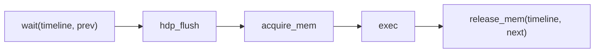

# Queues और Dispatch

एक kernel dispatch करने का मतलब है command packets को एक ring buffer में लिखना और एक
doorbell बजाना। यह पेज ring machinery (`AmdComputeQueue`), उसे wrap करने वाले per-owner
bundle (`AmdConnector`), दो dispatch strategies (single-queue बनाम multi-queue), completion
primitive (`Timeline`), और हर उस environment variable को कवर करता है जो बैकएंड को configure
करता है।

इस design का आकार एक तथ्य से आता है: **tinygrad GIL-serialized है** — प्रति device एक
compute queue, और Python का GIL हर dispatch को atomic बना देता है। Svod असली concurrency
पाने के लिए GIL को हटा देता है, इसलिए GIL ने जो invariants दिए थे उन्हें explicit रूप से
फिर से बनाना पड़ता है। नतीजा एक ऐसा dispatch path है जो lock-free हो सकता है।

---

## Command ring: `AmdComputeQueue`

`device/src/amd/queue.rs` `AmdComputeQueue` को define करता है, जो इनका मालिक है:

- एक **16 MiB host-visible ring** (`COMPUTE_RING_BYTES`) — command packets सीधे CPU से इसमें
  लिखे जाते हैं;
- एक **doorbell** (`*mut u64` MMIO) — GPU के command processor को नया write-index यहाँ लिखकर
  "नया काम" बताया जाता है;
- GART-resident **write/read dispatch-id** slots — KFD doorbell के अलावा write pointer भी
  पढ़ता है, इसलिए यह पहले publish होता है।

### PM4 बनाम AQL

दो on-wire packet formats हैं, जिन्हें queue creation पर device के XCC count से एक बार चुना
जाता है:

```text
will_use_pm4(core) = !SVOD_AMD_AQL && num_xcc == 1
```

- **PM4** (single-XCC: gfx11/12 default) — raw PM4 dwords सीधे ring में लिखे जाते हैं
  (`KFD_IOC_QUEUE_TYPE_COMPUTE`)। doorbell को अगले dword index के साथ बजाया जाता है।
- **AQL** (multi-XCC CDNA) — 64-byte AQL packets (`KFD_IOC_QUEUE_TYPE_COMPUTE_AQL`), जिनमें
  PM4 helpers AQL vendor-IB packets के अंदर wrapped होते हैं। doorbell को last-completed slot
  (`write_idx - 1`) के साथ बजाया जाता है।

एक single PM4 dispatch एक fixed sequence है, tinygrad के `hcq.py:371-378` को mirror करते हुए:



`exec` वह `SET_SH_REG` stream है जो shader address, `RSRC1/2/3` registers, scratch
descriptor और `TMPRING_SIZE`, `USER_DATA` SGPRs, launch dims load करता है, फिर
`DISPATCH_DIRECT` और उसके बाद एक `CS_PARTIAL_FLUSH`। अंत का `release_mem` GPU के समाप्त होने
पर dispatch का timeline value connector के signal slot में लिखता है।

### Lock-free interior mutability

`AmdComputeQueue.inner` एक `UnsafeCell<QueueInner>` है, `Mutex` नहीं — dispatch इसे `&self`
के माध्यम से बिना किसी lock के mutate करता है। यह एक **single-owner invariant** के कारण
sound है: एक `ConnectorLease` के जीवनकाल के लिए, ठीक एक thread queue के विरुद्ध sequential,
non-reentrant dispatch जारी करता है (वही pattern जो `RawBuffer` `device/src/allocator.rs`
में उपयोग करता है)। shared drainer कभी queue को नहीं छूता — वह केवल timeline पढ़ता है (नीचे
देखें)। अलग-अलग connectors की queues को GPU के hardware scheduler (MES — the MicroEngine
Scheduler) द्वारा interleave किया जाता है, किसी CPU lock से नहीं।

### Ring back-pressure

एक host जो `wait=false` को GPU के drain होने से तेज़ चला रहा हो, वह 16 MiB ring को lap कर
देगा और unconsumed packets को overwrite कर देगा। `wait_dispatch_headroom` इसे रोकता है, यह
un-retired dispatches की संख्या को `RING_MAX_INFLIGHT` (ring का आधा) तक bound करके, और bound
पहुँचने पर **timeline signal** पर block करके:

```rust
let last_reserved = conn.timeline_value().saturating_sub(1);
if last_reserved > RING_MAX_INFLIGHT {
    let target = last_reserved - RING_MAX_INFLIGHT;
    conn.timeline_signal().wait_signal_value(target, 30_000)?;
}
```

यह timeline signal पर gate करता है — सिद्ध completion primitive — न कि PM4 read pointer पर,
जिसकी COMPUTE-queue semantics अविश्वसनीय हैं और एक spin को deadlock कर देंगी।

---

## Per-owner bundle: `AmdConnector`

अकेली queue dispatch के लिए पर्याप्त नहीं है। `AmdConnector`
(`device/src/amd/connector.rs`) वह सब कुछ bundle करता है जिसकी एक independent caller को
ज़रूरत होती है:

| Field | यह क्या है |
|---|---|
| `queue: Box<AmdComputeQueue>` | ring + doorbell + GART (एकमात्र owner → lock-free) |
| `arena: Box<KernargArena>` | एक 16 MiB GTT kernarg bump arena |
| `scratch_state: Mutex<ScratchState>` | Register-spill scratch backing, माँग पर बढ़ता है |
| `timeline: Arc<Timeline>` | monotonic counter + completion signal |

हर `ExecutionPlan` और हर `AmdGraph` अपने ख़ुद के connector का मालिक है। queue और arena पर
`Box` (न कि `Arc`) load-bearing है: यह सिद्ध करता है कि `UnsafeCell` को alias करने वाला कोई
दूसरा handle नहीं है, जो lock-free dispatch को sound बनाता है। arena per-connector है ताकि
उसका bump cursor और connector का timeline एक ही ordering साझा करें — एक wrapped kernarg slot
उस timeline के drain हो जाने पर provably free होता है।

`ensure_has_local_memory(private_segment_size)` scratch buffer को तब बढ़ाता है जब एक
ताज़ा-loaded kernel को वर्तमान में allocate किए गए से अधिक bytes-per-thread चाहिए
(alloc new → swap → drain → free old)। Scratch GPU-only VRAM है, dynamically realloc'd है,
और `NotPresent` faults का ऐतिहासिक स्रोत है — देखें [Debugging](./debugging.md)।

---

## दो dispatch strategies

per-device `Dispatcher` enum (`device/src/amd/device.rs`) चुनता है कि owners को connector
कैसे मिले और dispatch serialized है या नहीं। यह device-open पर `SVOD_AMD_SINGLE_QUEUE` से एक
बार बनता है:

### Single-queue (default)

```text
SVOD_AMD_SINGLE_QUEUE unset or ≠ 0
```

हर owner प्रति physical device **एक** connector साझा करता है, और dispatch +
scratch-realloc `exec_guard()` के माध्यम से लिए गए एक `Mutex<()>` के पीछे serialized होते
हैं। तब kernel हमेशा प्रति GPU केवल एक compute queue देखता है — tinygrad का model।

यह **KFD-safe** mode है, और यह एक ठोस वजह से default है: भारी concurrent multi-queue
dispatch **kernel के MES/runlist scheduler को overload कर देता है और kernel को crash कर
सकता है**। एक GPU के पास एक command processor होता है और वह वैसे भी dispatches sequentially
चलाता है; multi-queue केवल CPU-side packet assembly को overlap करता था, जो KFD को bad path में
ले गया। Single-queue उस crash को हटा देता है।

### Multi-queue (opt-in)

```text
SVOD_AMD_SINGLE_QUEUE=0
```

हर owner एक idle pool से एक **exclusively-owned** connector lease करता है (`CONNECTOR_POOL_CAP = 4`
द्वारा bounded); MES N queues को interleave करता है, इसलिए dispatch को किसी CPU lock की ज़रूरत
नहीं और `exec_guard()` `None` return करता है। lease का exclusive और un-aliasable होना ही दो
dispatchers को एक KFD queue साझा करने से रोकता है।

:::caution kernel-overload caveat
Multi-queue lock-free, अधिकतम-concurrent path है, लेकिन यही वह है जो load के तहत KFD को
overload करता है। इसी वजह से यह opt-in है। असली fix — GPU का मालिक होना ताकि kernel कभी
dispatch path में न हो — वह [userspace AM driver](./am-driver.md) है।
:::

### `ConnectorLease`

`lease_connector` एक `ConnectorLease` return करता है — एक non-`Clone` handle जो
`&AmdConnector` पर `Deref` करता है, इसलिए callers mode-agnostic रहते हैं। drop पर,
`return_connector` mode-उपयुक्त काम करता है: उसे फिर से pool में डालता है (multi-queue, cap
तक) या कुछ नहीं (single-queue — shared connector core पर ही रहता है)। यह drop पर synchronize
**नहीं** करता; connector का `Timeline` registered रहता है ताकि device-wide drain अब भी उसे
cover करे।

---

## Completion primitive: `Timeline`

`Timeline` (`device/src/amd/signal.rs`) एक monotonic `AtomicU64` counter है साथ ही वह
GTT-coherent `AmdSignal` slot जिसे GPU dispatch completion पर लिखता है। यह **वह एकमात्र
primitive है जो owners के पार जाता है**:

- एक connector उसके विरुद्ध *dispatch* करता है — `next()` `fetch_add(1)` करके उस value को
  reserve करता है जिसे उसका `release_mem` packet लिखेगा;
- कोई भी thread उसे *drain* कर सकता है — `drain()` atomic पढ़ता है और signal slot को poll
  करता है, **कभी queue को नहीं छूता**।

वही decoupling dispatch को lock-free रखता है। device core (`AmdDeviceCore`) हर connector के
लिए `Weak<Timeline>` रखता है — न कि `Weak<AmdConnector>` — इसलिए `synchronize_all` (किसी भी
host read या buffer free से पहले की fence) सभी in-flight work को विशुद्ध रूप से इन atomics के
माध्यम से drain करता है:

```text
AmdDeviceCore.synchronize_all():
   for each live Timeline:  timeline.drain(30s)   // atomics + signal slot only
```

`AmdSignal::wait_signal_value` tiers में poll करता है — tight spin → `yield_now` → 200 ms के
बाद KFD `WAIT_EVENTS` sleep — ताकि एक लंबा या stalled wait किसी CPU को न जलाए, और wait के
दौरान एक GPU fault पूरे 30 s timeout को block करने के बजाय तुरंत सामने आ जाए।

:::note 2³² wraparound
PM4 `WAIT_REG_MEM`/`RELEASE_MEM` signal slot के निचले 32 bits की तुलना करते हैं, इसलिए
counter को 2³² के नीचे रहना चाहिए। `ensure_timeline_headroom` हर value reserve करने से पहले
एक 2³¹ watermark (`TIMELINE_WRAP_WATERMARK`) पर drain और reset करता है, ताकि एक लंबा
`wait=false` loop 2³² से आगे न चढ़ सके और एक झूठा timeout produce न करे।
:::

---

## Seam

queue layer को जिन चारों kernel operations की ज़रूरत है वे सब device core पर
[`AmdIface`](./overview.md) trait के माध्यम से route होती हैं:

```rust
pub trait AmdIface: Send + Sync + std::fmt::Debug {
    fn alloc_raw(&self, size, kind, tag, cpu_access, zero) -> Result<AllocResult>;
    fn free_raw(&self, gpu_va, size, handle);
    fn setup_ring(&self, desc: &RingDesc) -> Result<QueueHandle>;
    fn teardown_ring(&self, queue_id: u32);
    fn wait_events(&self, timeout_ms: u32) -> Result<Option<Error>>;
}
```

ध्यान दें कि trait में क्या *नहीं* है: ring, GART, EOP और ctx-save buffers सब seam के ऊपर
(`alloc_raw` के माध्यम से) `create_queue` के अंदर allocate होते हैं। trait केवल queue को
**activate** करता है — `setup_ring` `CREATE_QUEUE` जारी करता है और एक ऐसे ring पर doorbell
को `mmap` करता है जिसका ऊपरी हिस्सा पहले से मालिक है। `KfdIface` आज एकमात्र implementor है।

---

## Configuration reference

हर वह environment variable जो AMD बैकएंड को प्रभावित करती है:

| Variable | Default | Effect |
|---|---|---|
| `SVOD_DEVICE` | `CPU` | tensors के लिए default device चुनता है। पहले AMD GPU पर चलाने के लिए `SVOD_DEVICE=AMD:0` सेट करें |
| `SVOD_AMD_BACKEND` | `kfd` | Backend selection। आज केवल `kfd` स्वीकार होता है; `am` भविष्य का seam है (सेट होने पर error) |
| `SVOD_AMD_SINGLE_QUEUE` | `1` (on) | `=0` lock-free multi-queue dispatch चुनता है; अन्यथा KFD-safe single-queue mode |
| `SVOD_AMD_AQL` | `0` (off) | `=1` single-XCC hardware पर भी AQL packets force करता है — PM4 बनाम AQL issues को bisect करने के लिए |
| `SVOD_JIT_GRAPH` | unset | PM4 graph capture/replay enable करता है (multi-queue mode भी आवश्यक है)। देखें [Compile और Graph](./compile-and-graph.md) |
| `SVOD_KFD_TOPOLOGY` | sysfs path | topology root को override करता है, बिना hardware के testing के लिए |
| `SVOD_DEBUG_DISPATCH` | unset | per-dispatch kernel / grid / kernarg / scratch / buffer VAs dump करता है। देखें [Debugging](./debugging.md) |
| `SVOD_DUMP_AMD_IR` | unset | किसी directory पर सेट होने पर, हर kernel का AMD LLVM IR वहाँ dump करता है |

:::caution कोई `SVOD_AMD_MAX_QUEUES` नहीं है
multi-queue idle-pool size compile-time constant `CONNECTOR_POOL_CAP = 4` है जो `device.rs`
में है, कोई environment variable नहीं।
:::

---

## यह क्यों ज़रूरी है

GIL ने tinygrad को एक atomic dispatch critical section मुफ़्त में दिया। Svod उस guarantee को
तीन तरीक़ों से फिर से बनाता है: ring के लिए **single-owner ownership** (कोई dispatch lock
नहीं), drains के लिए एक **shared timeline signal** (atomics, कभी queue नहीं), और **explicit
ring back-pressure**। single-queue default आज kernel को safe रखता है; lock-free multi-queue
path तब के लिए तैयार है जब [AM driver](./am-driver.md) kernel को loop से पूरी तरह बाहर ले जाए।
