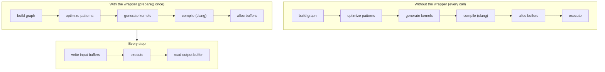

# JIT-графы

Стриминговый ASR-пайплайн вызывает один и тот же энкодер сотни раз.
Построение тензорного графа, его оптимизация, генерация исходного кода
ядер, компиляция через [clang](../backends/jit-loader.md) и выделение буферов
устройства на каждом вызове — это бесполезная работа, не зависящая от
входа.

Макрос `jit_wrapper!` и runtime-слой `model::jit` превращают этот паттерн
«собрать один раз / выполнять много раз» в **типизированную Rust-структуру**.
Вы объявляете входы и граф; макрос генерирует обёртку, которая
компилирует граф один раз во время `prepare()` и переигрывает его на
каждом `execute()` с буферами устройства, удерживаемыми на месте.



Обёртка композируется с [движком паттернов](./optimizations/pattern-system.md)
(который работает во время `prepare()`) и [JIT-загрузчиком](../backends/jit-loader.md)
(который превращает оптимизированные ядра в машинный код в памяти). Эта
страница описывает слой обёртки, расположенный над обоими.

---

## DSL `jit_wrapper!`

Объявление обёртки задаёт имя структуры, тип модели, который получает
замыкание сборки, входы, экспонируемые обёрткой, опциональные символические
переменные форм и блок `build`, который строит граф:

```rust
jit_wrapper! {
    MyModelJit(MyModel) {
        input1: Tensor,
        input2: Tensor,

        vars {
            b: (1, max_batch),
            t: (1, max_time),
        }

        build(input1, input2, b, t) {
            model.forward(input1, input2, &b, &t)
        }
    }
}
```

| Секция | Значение | Обязательна |
|---|---|---|
| `WrapperName(ModelType) { ... }` | имя генерируемой структуры и тип модели, который получает замыкание сборки | да |
| строки `input_name: Tensor` | по одной на каждый вход, экспонируемый обёрткой; аннотация `: Tensor` информационная | одна или более |
| `vars { name: (min, max), ... }` | символические переменные форм с границами времени компиляции | опционально |
| `build(args...) { ... }` | замыкание, строящее выходной тензор из входов и переменных; `model` доступен в области видимости | да |

Каждый аргумент `build` должен называть либо вход, либо объявленную
переменную (макрос отклоняет имена, не совпадающие ни с тем, ни с
другим, на этапе раскрытия). Внутри блока каждый вход — это `&Tensor`
(макрос выделяет нулевой плейсхолдер при запуске `prepare()`), каждая
переменная — это `svod_tensor::Variable`, уже привязанная к своей
верхней границе, а `model` — разделяемая ссылка на значение модели,
которым владеет обёртка. Замыкание возвращает `Result<Tensor, E>` для
любого `E: std::error::Error + Send + Sync + 'static`; сбои всплывают
как `JitError::Build`.

---

## Символические переменные

Блок `vars { ... }` объявляет значения, участвующие в графе как выражения
форм или индексов, но точное значение которых подаётся во время исполнения.
Они позволяют одному подготовленному плану обслуживать диапазон форм входов
без перекомпиляции.

Каждая запись `name: (min, max)` генерирует три конфигурационных сеттера на
обёртке:

| Сеттер | Эффект |
|---|---|
| `with_<name>_bound(max)` | переопределяет только верхнюю границу; паникует, если `max < min` |
| `with_<name>_min_bound(min)` | переопределяет только нижнюю границу; паникует, если `min > max` |
| `with_<name>_fixed(value)` | привязывает обе границы к `value`, превращая переменную в константу времени JIT; паникует при `value == 0` |

Все три возвращают `Self` (builder-стиль) и должны вызываться до
`prepare()`, потому что замыкание сборки захватывает границы при своём
запуске.

Более широкий диапазон порождает более общее ядро, которому приходится
обрабатывать каждую форму в диапазоне; более узкий диапазон позволяет
оптимизатору специализироваться. Фиксируйте переменную через
`with_<name>_fixed`, когда значение никогда не меняется, и уменьшайте
верхнюю границу, когда внешний вызывающий код объявляет меньший
максимум, чем жёсткий потолок модели.

Во время выполнения передавайте фактические значения через
`execute_with_vars`:

```rust
jit.execute_with_vars(&[("b", batch as i64), ("t", time as i64)])?;
```

Каждая пара привязывает одну переменную; переменные, не указанные в
списке, сохраняют значение, к которому были привязаны при `prepare()`
(их верхнюю границу).

---

## Сгенерированный runtime-API

Макрос порождает по одной группе методов на каждую фазу жизненного цикла
обёртки:

| Метод | Фаза | Примечания |
|---|---|---|
| `new(model)` | конструирование | принимает модель по значению; ядра ещё не скомпилированы |
| `with_<var>_bound` / `with_<var>_min_bound` / `with_<var>_fixed` | между `new` и `prepare` | настройка диапазона форм |
| `prepare(input1: InputSpec, ...)` | однократная | строит граф, прогоняет паттерны, компилирует ядра, выделяет буферы; читает `PrepareConfig::from_env()` |
| `prepare_with_config(..., &PrepareConfig)` | однократная | то же, что `prepare`, но с явной конфигурацией |
| `<input>_mut() -> Result<&mut Buffer>` | на каждом шаге | типизированный аксессор для каждого объявленного входа |
| `output() -> Result<&Buffer>` | на каждом шаге | выход подготовленного графа |
| `execute() -> Result<()>` | на каждом шаге | переигрывание с текущими входными буферами |
| `execute_with_vars(&[(name, value)]) -> Result<()>` | на каждом шаге | переигрывание и перепривязка одной или нескольких символических переменных |
| `execute_profiled` / `execute_with_vars_profiled` | опционально | то же, что варианты без профилирования, но возвращают `Vec<KernelProfile>` |

Четыре низкоуровневых аксессора раскрывают детали плана для инструментов:

| Аксессор | Возвращает |
|---|---|
| `buffers()` | все буферы, которыми владеет план |
| `output_buffers()` | объявленные планом выходные буферы |
| `input_buffer_ids()` | идентификаторы буферов устройства, в которые пишет обёртка |
| `prepared_kernels()` | скомпилированные ядра |

Большинству вызывающих они не нужны. Вызов любого пошагового метода до
`prepare()` возвращает `JitError::NotPrepared`.

---

## `InputSpec`

`prepare()` принимает по одному `InputSpec` на каждый объявленный вход:

```rust
pub struct InputSpec {
    pub shape: Vec<usize>,
    pub dtype: DType,
}

impl InputSpec {
    pub fn new(shape: &[usize], dtype: DType) -> Self { ... }
    pub fn f32(shape: &[usize]) -> Self { ... }
    pub fn i32(shape: &[usize]) -> Self { ... }
    pub fn i64(shape: &[usize]) -> Self { ... }
}
```

Макрос использует форму и dtype, чтобы выделить нулевой плейсхолдер-тензор
до вызова замыкания сборки. Вызывающим не нужно самим конструировать
плейсхолдеры `Tensor::zeros(...).realize()`. Форма становится максимальным
размером входа; символические переменные уменьшают её во время выполнения
через операции вроде `try_shrink` — это паттерн написания кода, а не
runtime-контракт, навязываемый обёрткой.

---

## Рекуррентное выполнение

Рекуррентные модели переиспользуют LSTM-состояние на стороне хоста между
вызовами. Обёртка для этого паттерна — `JitRecurrent<J>`. Она принимает
JIT, сгенерированный `jit_wrapper!`, который также реализует трейт
`RecurrentJit`, плюс начальное `LstmState` и длину «головы» в элементах
`f32`:

```rust
pub struct LstmState {
    pub h: Vec<f32>,
    pub c: Vec<f32>,
}

pub trait RecurrentJit {
    fn pack_state(&mut self, state: &LstmState) -> Result<()>;
    fn execute_step(&mut self) -> Result<()>;
    fn output_buffer(&self) -> Result<&Buffer>;
}
```

:::tip Контракт раскладки выхода
Выходной буфер JIT должен быть плоским `f32`-блоком вида
`[head | h_flat | c_flat]` по последней оси, где `h_flat` и `c_flat`
имеют длины `state.h.len()` и `state.c.len()` соответственно.
`JitRecurrent::new` один раз читает выходной буфер при конструировании,
сверяет количество элементов с объявленной длиной головы плюс размер
состояния и возвращает `JitError::OutputLayoutMismatch`, если арифметика
не сходится. Это ловит дрейф в замыкании сборки на этапе конструирования,
не позволяя тихому неверному разбиению испортить значения ниже по
пайплайну.
:::

Каждый вызов `step(|jit| pack_inputs(jit))` выполняет одну рекуррентную
итерацию:

1. Замыкание записывает не-состоянийные входы шага (аудио-чанк,
   token id, кадр энкодера, ...) через типизированные аксессоры `*_mut`
   JIT.
2. `RecurrentJit::pack_state` копирует текущее хост-состояние в
   входные буферы состояния JIT.
3. `execute_step` переигрывает план.
4. Обёртка разбивает выходной буфер на голову, новые `h`, новые `c`,
   обновляет хост-состояние на месте и возвращает срез головы как
   `&[f32]`.

`reset()` обнуляет хост-состояние, не трогая JIT, готовя его к новой
последовательности. `last_timing` раскрывает последние длительности
`pack` / `exec` / `read` для каждого шага для целей профилирования.

---

## Пример: энкодер GigaAM

Энкодер GigaAM Conformer работает на переменном размере батча и длине
по времени. Обе границы символические, так что один подготовленный план
обслуживает любой аудио-чанк:

```rust
jit_wrapper! {
    GigaAmEncoderJit(GigaAm) {
        mel: Tensor,
        lengths: Tensor,

        vars {
            b: (1, model.config.max_batch_size),
            t: (1, model.config.max_mel_frames),
        }

        build(mel, lengths, b, t) {
            let out = model.encoder.forward_batch(mel, lengths, &b, &t)?;
            out.cast(svod_dtype::DType::Float32).context(TensorSnafu)
        }
    }
}
```

Обёртка принимает на вход mel-спектрограмму и вектор длин по батчу и
производит закодированный выходной тензор `[B, d_model, T_sub]`.
Переменные `b` и `t` привязываются к своим верхним границам в `prepare()`,
затем перепривязываются на каждом батче через
`execute_with_vars(&[("b", batch_size as i64), ("t", mel_frames as i64)])`.

Завершающий `out.cast(DType::Float32)` — это fp32-граница между
энкодером и любой нижестоящей «головой». Энкодер может работать в fp16
или bf16 ради скорости, но каждый потребитель (CTC log-softmax, RN-T
предиктор и joint) видит однородный fp32-вход. Размещение каста внутри
JIT позволяет ему слиться в хвостовые ядра энкодера.

---

## Пример: Silero VAD

Модель Silero VAD — это рекуррентная сеть, выдающая одну вероятность
речи на чанк и обновлённое LSTM-состояние. JIT экспонирует аудио-чанк
плюс два тензора состояния как входы и конкатенирует
`[prob | new_h | new_c]` как свой выход:

```rust
jit_wrapper! {
    SileroVadJit(SileroVad) {
        chunk: Tensor,
        state_h: Tensor,
        state_c: Tensor,

        build(chunk, state_h, state_c) {
            model.forward_chunk(chunk, state_h, state_c)
        }
    }
}
```

`forward_chunk` завершается `Tensor::cat(&[&prob, &new_h, &new_c], 1)` —
именно той раскладкой, которую ожидает рекуррентная обёртка. Реализация
`RecurrentJit` напрямую отображает методы трейта на аксессоры,
сгенерированные макросом:

```rust
impl RecurrentJit for SileroVadJit {
    fn pack_state(&mut self, s: &LstmState) -> Result<()> {
        // копируем s.h в state_h_mut, s.c в state_c_mut
    }
    fn execute_step(&mut self) -> Result<()> { self.execute() }
    fn output_buffer(&self) -> Result<&Buffer> { self.output() }
}
```

Конструирование один раз подготавливает JIT и оборачивает его вместе с
хост-состоянием:

```rust
let mut jit = SileroVadJit::new(vad);
jit.prepare(
    InputSpec::f32(&[1, CHUNK_LEN]),
    InputSpec::f32(&[1, HIDDEN]),
    InputSpec::f32(&[1, HIDDEN]),
)?;
let inner = JitRecurrent::new(jit, LstmState::zeros(HIDDEN), 1)?;
```

Длина «головы» `1` — это единственный скаляр вероятности речи.
`LstmState::zeros(HIDDEN)` выделяет `h` и `c` длиной `HIDDEN`, поэтому
проверка раскладки выхода удостоверяется, что выход JIT — ровно
`1 + HIDDEN + HIDDEN` `f32`-элементов. Обработка одного чанка тогда
становится такой:

```rust
let prob = inner.step(|jit| {
    let buf = jit.chunk_mut()?;
    // копируем аудио-сэмплы в buf
    Ok(())
})?;
```

---

## Контракт независимости от данных

Обёртка компилирует граф один раз и переигрывает его много раз. Это
работает только если топология графа фиксирована во время `prepare()`.
Всё, что может меняться во время исполнения, должно течь через входные
буферы (через `*_mut`) или символические переменные (через
`execute_with_vars`). Ветвление по значению тензора внутри замыкания
сборки специализирует граф к этой ветви: это решение времени сборки, а
не времени выполнения.

:::note Подводные камни
- `Tensor::full(value).realize()` внутри замыкания сборки запекает это
  значение в единственный подготовленный план. Любое варьирование от
  вызова к вызову требует повторного запуска `prepare()` с нуля — полная
  сборка графа плюс компиляция ядер. Скретч-буферы на стороне хоста
  (например, `ndarray::Array3`) — правильный выбор для пошаговой
  подготовки, которую JIT видеть не должен.
- Идиоматический способ обрабатывать динамическую форму внутри JIT — это
  `try_shrink` на входе максимального размера с длиной, привязанной к
  переменной, в паре с `execute_with_vars` на стороне вызова. И «голова»
  CTC, и энкодер используют этот паттерн.
:::

Нарушение контракта приводит к одному из двух режимов отказа: неверные
результаты, потому что закешированный план переигрывается с устаревшим
предположением о значении, которое оказалось изменчивым; или тихое
замедление, потому что каждый вызов попадает на путь перекомпиляции.
Диагностируйте их перечитыванием замыкания сборки; вывод ядер редко
помогает.

---

## Ошибки

`JitError` покрывает runtime-сбои, которые может вызвать обёртка.
Большинство из них неисправимы и указывают на баг использования, а не
на временное состояние.

| Вариант | Чем вызывается |
|---|---|
| `NotPrepared` | пошаговый метод вызван до `prepare` или выходной буфер недоступен |
| `InputBufferNotFound` | резолвинг индекса входа провалился внутри подготовленного плана |
| `DuplicateInputBuffer` | два объявленных входа отображаются в один и тот же буфер устройства во время `prepare` |
| `Build` | замыкание сборки вернуло `Err`; внутренняя ошибка сохраняется как `Box<dyn Error>` |
| `Tensor` | тензорная операция в `prepare` или в замыкании сборки завершилась с ошибкой |
| `Device` | операция устройства или с буфером завершилась с ошибкой |
| `OutputLayoutMismatch` | `JitRecurrent::new` увидел количество элементов на выходе, отличное от объявленной длины головы плюс размера состояния |
| `Runtime` | исполнение ядра завершилось с ошибкой |

Ошибки конфигурации в сеттерах символических переменных (`with_<var>_*`)
паникуют на месте вызова, а не возвращают ошибку, поскольку происходят
до того, как какой-либо план существует.

---

## Почему это важно

**Жизненный цикл типизирован.** `prepare` — единственный способ перейти
в подготовленное состояние; пошаговые аксессоры — единственный способ
из него выйти. Порядок навязан компилятором.

**Переигрывание дёшево.** Одна сборка графа, одна компиляция ядер, одно
выделение буферов — оплачивается один раз. Каждый последующий вызов —
это запись в буферы плюс `execute`.

**Контракт локален.** Правило независимости от данных — единственный
инвариант, позволяющий обёртке безопасно пропускать танец на каждом
вызове. Все остальные гарантии вытекают из него.

**Ошибки явны.** Runtime-сбои всплывают как варианты `JitError`;
паникует только неправильное использование сеттеров переменных на этапе
конфигурации.

Обёртка не изобретает новых примитивов. Она берёт цикл
build / prepare / execute и придаёт ему форму, которую может удержать
система типов, так что стриминговый инференс работает со скоростью
однократного вычисления без накладных расходов на каждый вызов.
